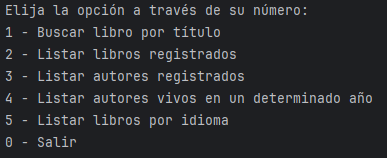
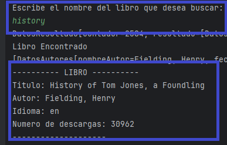
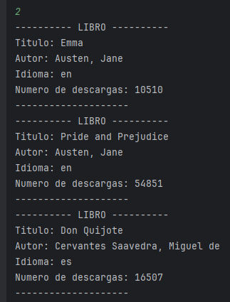
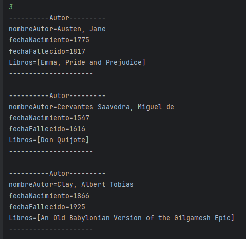
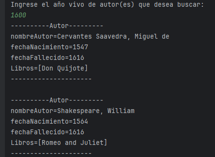
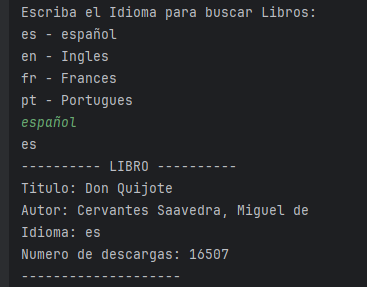

# 📚 Challenge Literalura

Este proyecto consiste en una aplicación de consola desarrollada en Java con Spring Boot, que permite gestionar información sobre libros y autores utilizando una API externa (Gutendex) y persistencia en base de datos PostgreSQL.

## 💻 Tecnologías utilizadas

- Java 17+
- Spring Boot
- Spring Data JPA
- PostgreSQL
- Jackson
- Maven

## 📜 Funcionalidades

Al ejecutar la aplicación, verás un menú con las siguientes opciones:

### 1️⃣ Buscar libro por título

Permite consultar un libro utilizando la API externa por su nombre. Si el libro no está en la base de datos, se guarda junto con su autor.
Nota:  
- No permite registrar libro repetido.  
- Si hay mas de una coincidencia en la busquedad del libro se guarda el que tiene mayor cantidad de descargas.  

### 2️⃣ Listar libros registrados

Muestra todos los libros almacenados en la base de datos ordenados alfabéticamente por título.

### 3️⃣ Listar autores registrados

Muestra todos los autores almacenados, incluyendo los libros que han escrito.

### 4️⃣ Listar autores vivos en un determinado año

Filtra y muestra a los autores que estaban vivos durante el año ingresado por el usuario.

### 5️⃣ Listar libros por idioma

Filtra y muestra los libros según el idioma seleccionado. Los idiomas disponibles son los definidos en el `enum Idioma`:
- `es` - Español
- `en` - Ingles
- `fr` - Frances
- `pt` - Portugues

---

## Configura tu base de datos en application.properties.
